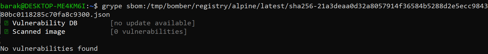
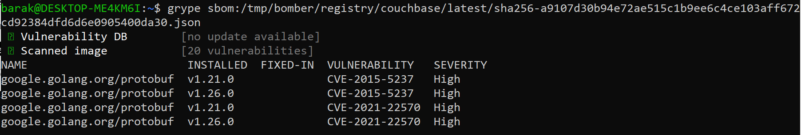
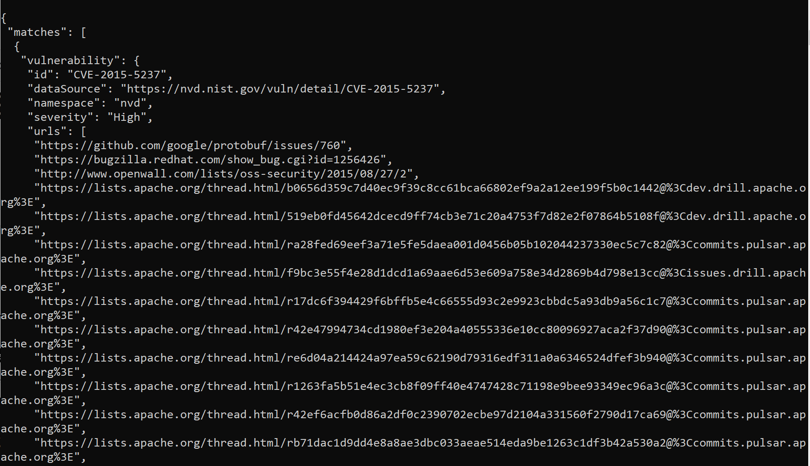

# Checking the SBOM for CVEs

In order to scan the resulting SBOM for CVEs you can use <a href='https://github.com/anchore/grype'>Grype</a>. Grype is an open-source tool that can provide static CVE analysis on your SBOM. Grype does not require an internet connection to work – it uses a list of known CVEs that is included with the tool when you first download it. In an integrated environment (connected to the internet), Grype checks on each run if there are new CVEs to add to its DB. To avoid this check you can add a .grype.yaml configuration file where updating the DB is marked as false:   
```
db:
  auto-update: false
```  

It’s recommended that you periodically download the latest version of Grype or allow it to update the CVE DB to make sure you have the latest CVE listing. 
After you have downloaded the binary you can scan the SBOM using this command:   
```grype sbom:./image-sbom.json```   

Here’s an example for the Grype scan of Alpine – no vulnerabilities found.
<!--    -->


Here’s an example for the Grype scan of Couchbase – some vulnerabilities found.
<!--    -->


To get more exact information, it’s recommended to use the flag -o (format) with the option ‘json’ like this:   
```grype sbom:./image-sbom.json -o json```

The result would be listed in stdout and look like this:  
<!--  -->

etc'...

Since the result of Grype is fully directed to stdout you can grab the result into a file using this cli format:   
```grype sbom:./image-sbom.json -o json > report.json``` 

The resulting json file will contain the full report of the CVE’s found in this SBOM.

The json CVE format looks like this:   
```
{
  "vulnerability": {
    ...
  },
  "relatedVulnerabilities": [
    ...
  ],
  "matchDetails": [
    ...
  ],
  "artifact": {
    ...
  }
}
```

And here’s an example of a single vulnerability from Couchbase’s result json:   
```
{
   "vulnerability": {
    "id": "CVE-2021-22570",
    "dataSource": "https://nvd.nist.gov/vuln/detail/CVE-2021-22570",
    "namespace": "nvd",
    "severity": "High",
    "urls": [
     "https://github.com/protocolbuffers/protobuf/releases/tag/v3.15.0",
     "https://lists.fedoraproject.org/archives/list/package-announce@lists.fedoraproject.org/message/IFX6KPNOFHYD6L4XES5PCM3QNSKZBOTQ/",
     "https://lists.fedoraproject.org/archives/list/package-announce@lists.fedoraproject.org/message/3DVUZPALAQ34TQP6KFNLM4IZS6B32XSA/"
    ],
    "description": "Nullptr dereference when a null char is present in a proto symbol. The symbol is parsed incorrectly, leading to an unchecked call into the proto file's name during generation of the resulting error message. Since the symbol is incorrectly parsed, the file is nullptr. We recommend upgrading to version 3.15.0 or greater.",
    "cvss": [
     {
      "version": "2.0",
      "vector": "AV:N/AC:L/Au:N/C:N/I:N/A:P",
      "metrics": {
       "baseScore": 5,
       "exploitabilityScore": 10,
       "impactScore": 2.9
      },
      "vendorMetadata": {}
     },
     {
      "version": "3.1",
      "vector": "CVSS:3.1/AV:N/AC:L/PR:N/UI:N/S:U/C:N/I:N/A:H",
      "metrics": {
       "baseScore": 7.5,
       "exploitabilityScore": 3.9,
       "impactScore": 3.6
      },
      "vendorMetadata": {}
     }
    ],
    "fix": {
     "versions": [],
     "state": "unknown"
    },
    "advisories": []
   },
   "relatedVulnerabilities": [],
   "matchDetails": [
    {
     "type": "cpe-match",
     "matcher": "stock-matcher",
     "searchedBy": {
      "namespace": "nvd",
      "cpes": [
       "cpe:2.3:a:google:protobuf:v1.21.0:*:*:*:*:*:*:*"
      ]
     },
     "found": {
      "versionConstraint": "< 3.15.0 (unknown)",
      "cpes": [
       "cpe:2.3:a:google:protobuf:*:*:*:*:*:*:*:*"
      ]
     }
    }
   ],
   "artifact": {
    "name": "google.golang.org/protobuf",
    "version": "v1.21.0",
    "type": "go-module",
    "locations": [],
    "language": "",
    "licenses": [],
    "cpes": [
     "cpe:2.3:a:google:protobuf:v1.21.0:*:*:*:*:*:*:*"
    ],
    "purl": "pkg:golang/google.golang.org/protobuf@v1.21.0",
    "upstreams": []
   }
  },
```

