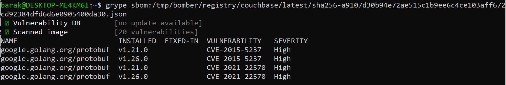

# Detecting CVEs

You can list all the CVEs relevant to a software artifact as follows: 
1. Generate an SBOM with gensbom
2. Run <a href='https://github.com/anchore/grype'>Grype</a> on this SBOM. grype is an open-source tool you can run offline or online. If you run offline, you will need to update the tool frequently and suppress the automatic update.
 
```grype sbom:./image-sbom.json```   

When no vulnerabilities found:


When vulnerabilities found:


For more details on CVEs run:   
```grype sbom:./image-sbom.json -o json```
