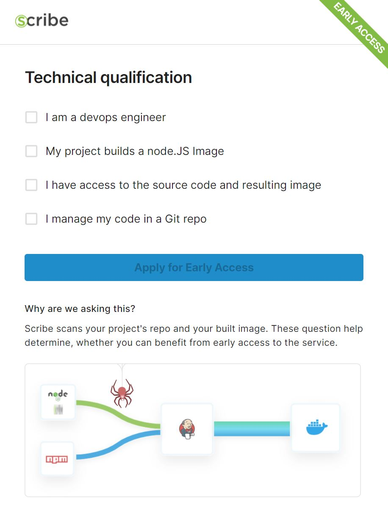
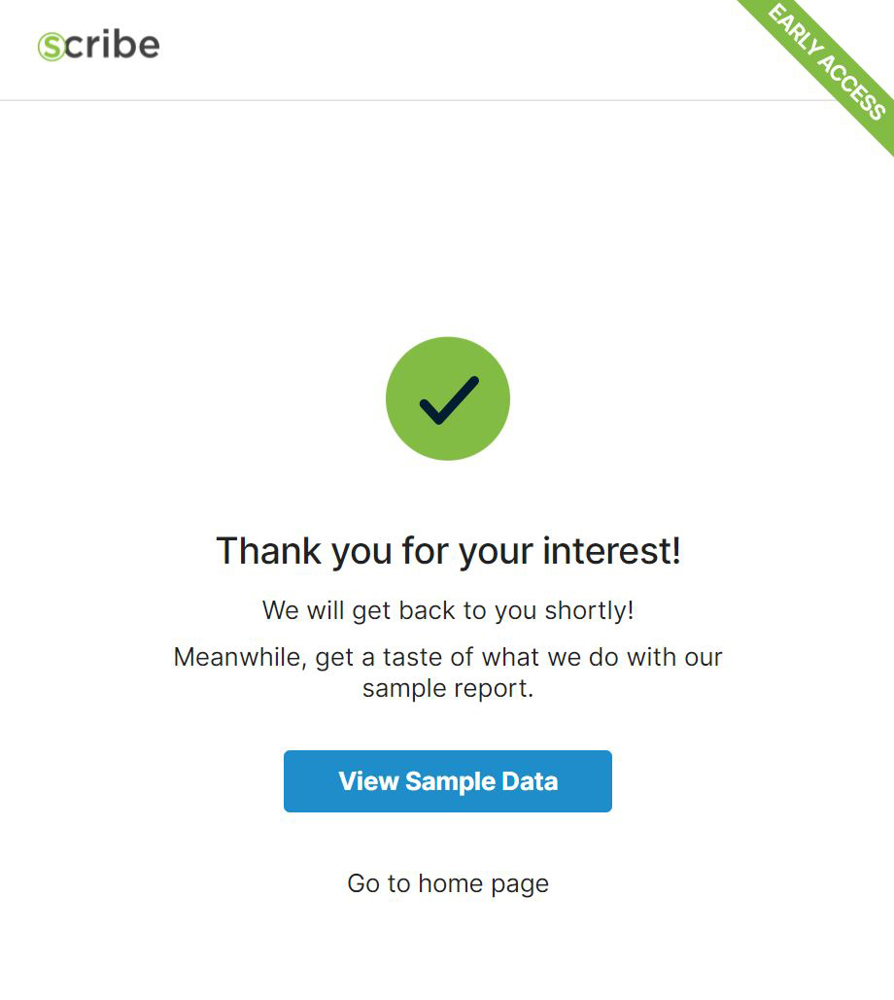
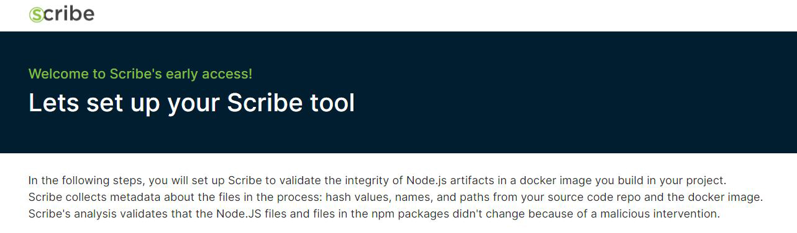
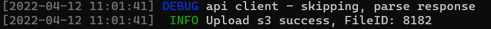
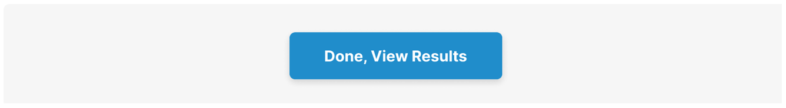
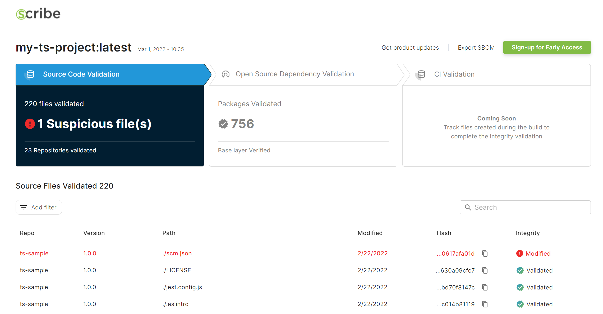
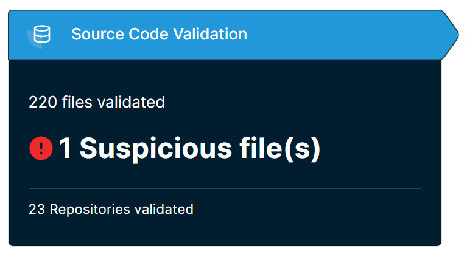
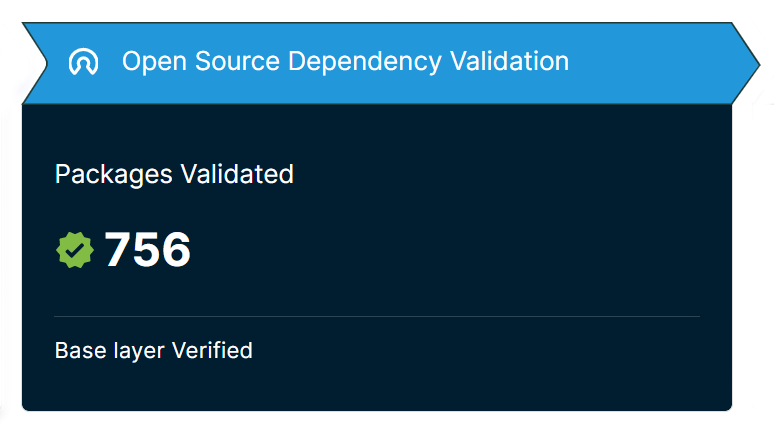
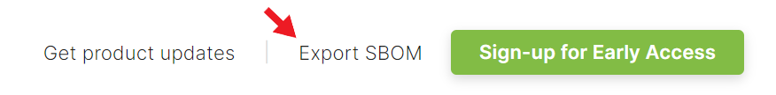

# Getting started

## Overview of Scribe

Scribe is a solution for DevSecOps teams and Security teams who want to govern security of software in the development process. Scribe enables you to collect and share evidence about the security level of these processes. You can share such evidence with stakeholders who are responsible for the internal deployment or with external consumers of your software. For example, with Scribe you can analyze and share the Software Bill of Materials (<a href='https://scribesecurity.com/sbom/'>SBOM</a>) of your product with your customers.
Scribe works either as an Internet service or as a standalone tool.  As a service, Scribe collects evidence and manages it in an immutable store. Scribe analyzes the evidence to rule out tampering. It can also be used to set a policy to govern the admission or delivery of software artifacts. Finally, Scribe facilitates evidence sharing workflows with software consumers.

## About SBOM

An SBOM is a list of a software artifact’s components. SBOMs are a tool for the receiver or operator of this software to manage risks such as exposure to new and existing vulnerabilities in the open-source dependencies in that software. The SBOM includes information such as the dependencies, versions, package URLs, and file locations.

## Additional evidence collection

In the upcoming versions of Scribe, you will be able to collect additional evidence from different steps in the software development life cycle. This serves for proving that the development process and the product are secure. For example, evidence of code committer identity, code review, static and dynamic code testing, etc. To prevent tampering, evidence is cryptographically signed with various signing schemes. 

## QuickStart

Find out what all the components that made their way into your Node.js’s project final docker image are and make sure they are all identical when compared to their origin.
Scribe tracks all files from their origin source code repo up to the final image and validates that each file’s hash value hasn’t changed if it wasn’t supposed to. 

System prerequisite:
The tool works on Mac and Linux systems only. If you want access to external docker images from public registries, docker daemon should be installed before you install the CLI tool.  
## Generating a report through the Scribe site

At the moment the only way to get the scribe tool’s analysis report is to run it through the scribe website.   
Go to: https://mui.production.scribesecurity.com/ and choose the 'sign up for early access' button. 


This will lead you to a form where you can start the registeration for early access.  
The first page of the form is a simple personal data page.


Pick the company size and role that best describe you. Note that all fields are mandatory.  
The next page checkss your technical qualifications. Note that you need to mark all of the check boxes to gain early access to our tool.  
Since our tool scans your git repo and node.js built image we aim to check if your project can benefit from the current tool iteration.  



Once you have clicked on the 'apply for early access' button you'll be directed to a thank you note. Now Scribe's team needs to verify your data and approve you for early access. 



Once you're approved you'll receive an email with a uniqe link to the early access page that looks like this:



This page outlines a list of simple steps to take to be able to get an integrity report for your git repo and docker image. Note that the username and password used in the linked code is unique to you. 

* Open a bash session

* To download the Scribe tool, gensbom, type in the following command:  
```   curl https://www.scribesecurity.com/getscribe | sh ```

* Clone the source repo of your docker image to your local machine and enter the following command (replacing `<your_repo>` with your source repo path):   
```   git clone <your_repo> ```

**your_repo** is the path to your git repo, for example: ```github.com/MrBLightning/IFeelU```  
Note – you cannot run the tool on a Git repo you do not have administrator permissions for.

* Run the following command that collects the metadata about your source code. Replace `<path>` with the path to the repo you cloned:  
```   $HOME/.scribe/bin/gensbom bom dir:<path> -vv --scribe.url=https://api.production.scribesecurity.com --scribe.loginurl=https://scribesecurity-production.us.auth0.com --scribe.auth0.audience=api.production.scribesecurity.com --scribe.username=<unique_username> --scribe.password=<unique_password> --name=scribe -E -f --insecure ```  
The SBOM generated will be automatically uploaded to Scribe's backend.
Look for this success message to mark the end of the SBOM generation and its successful upload:
<!--  -->


* Run the following command that collects the metadata about your docker image. Replace `<your_docker_image>` with the name of the docker image:  
```   $HOME/.scribe/bin/gensbom bom <your_docker_image> -vv --scribe.url=https://api.production.scribesecurity.com --scribe.loginurl=https://scribesecurity-production.us.auth0.com --scribe.auth0.audience=api.production.scribesecurity.com --scribe.username=<unique_username> --scribe.password=<unique_password> --name=scribe -E -f --insecure ```  
The SBOM generated will be automatically uploaded to Scribe's backend.

* Once You have generated both SBOMs you can go ahead and press the 'done' button to head over to your report:   
<!--    -->


* This will take you to your analysis report screen. The screen looks like this:  
<!--    -->


The first area to note is on the top left, the **Source Code Validation**:  


This area tells you how many files were validated (exact match to their original hashes) when compared to the source control repo. In this example 220 files were validated out of 23 repositories. There is 1 suspicious file that changed unexpectadly between the repository and the build.

The second area to note is in the top middle of the page, the **Open-Source Dependency Validation**: 


This area tells you how many open-source packages were validated (exact match to their original hashes) when compared to the Scribe’s record of the correct open-source package location. In this example 756 packages were identified and validated. 

At the very top of the page on the right you can see the button that allows you to download a signed SBOM describing exactly the list of components, packages and files described in this report. The SBOM is cryptographically signed using Scribe’s certificate.
  

At the bottom part of the page, you can see a full list of the files and packages identified in your image and the comparison result.  

The Filter button on the left allows you to filter the results by various options, for example, to see all files that were modified between the source repo and the final image.   

The Search button on the right allows you to search for particular packages or files you are interested in finding, for example Log4J. Note that for each file you can see its exact path in your image.   

And that’s it – you have now seen tha analysis report and can download an SBOM you can look over and experiment with.  

If you want to dive deeper into the functionality of Scribe’s CLI tool you’re welcome to read on.


